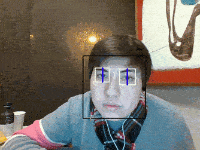

# Hack UCSC 2017 - Who's Lazy? Not Eye.
Who's Lazy, Not Eye allows any webcam to act as vision therapy for lazy eye by monitoring their eyes as they use their PC.  It will pause your media player if your eyes go lazy and will resume once you bring your eyes back into focus.  This is not guaranteed to work on all media players. This is currently a work in progress.

For Collaborators, here is the [Planning Thread](https://github.com/zAMLz/hackucsc-lazyeye/issues/1)

##Tested Media Players
* Spotify
* VLC
* Media player Classic
* Windows Media Player

### Here it is in action




## Install
To use this program, you must first ensure that you have the proper dependencies. It is highly recommened to use a python distribution such as anaconda or WinPython as it will proved alot of the necessary libraries for you.
* OpenCV version 3.2
* SciPy
* Playerctl (linux)

This program was also coded to be used for Python 2.
To run this program type the following in a terminal.

```
python2 lazy.py
```
You can add this command to a shortcut in Windows if you don't want to type it everytime. Make sure you reference the right script.

## Usage
Once you launch lazy.py there will be a taskbar icon that will be used to start and pause the program. Once it is started a window will popup and your webcam will be started. In the window it will show your webcam's stream with the tracking boxes around your eyes with a vertical line tracking your pupils.  You can now start your media player, and minimize the webcam window.  When using, you will need to look directly at the webcam, and if one of your eyes go lazy the media player will pause and send you an alert.  It will resume once you bring your eyes back into focus.  To quit the program, right click on the taskbar and click exit.  
## Develop
